# Training Institute Management Platform

A full-stack Training Institute Management Platform built using the MERN
stack. The system centralizes student, trainer, course, batch,
enrollment, attendance, fee, result, authentication, dashboard, and
reporting workflows.

## 1. Project Overview

The platform replaces fragmented/manual institute-management processes
with a centralized web application. It provides persistent MongoDB
storage, JWT authentication, role-based authorization, business
validation, role-specific dashboards, academic operations, fee tracking,
result management, and reports.

### Main Roles

-   **ADMIN** -- manages institute master data and operations.
-   **TRAINER** -- works with assigned training activities, students,
    attendance, results, and reports as permitted.
-   **STUDENT** -- views personal academic information, attendance,
    fees, results, courses, and profile.

## 2. Key Features

-   User registration and login
-   JWT-based authentication
-   Role-based access control
-   Password change
-   Student management
-   Trainer management
-   Course management
-   Batch management
-   Student enrollment
-   Attendance tracking
-   Fee/payment tracking
-   Result/marks management
-   Dashboard analytics
-   Search/filter/pagination where implemented
-   CSV report export where implemented
-   Business-rule validation
-   MongoDB persistent storage
-   Seed/demo data
-   Responsive React UI

## 3. Technology Stack

### Frontend

-   React.js
-   Vite
-   Tailwind CSS
-   React Router
-   Axios
-   Recharts
-   Lucide React

### Backend

-   Node.js
-   Express.js
-   MongoDB
-   Mongoose
-   JWT
-   bcrypt/bcryptjs

## 4. Project Structure

``` text
Training-Institute-Management-Platform/
│
├── client/
│   ├── src/
│   │   ├── api/
│   │   │   └── axios.js
│   │   │
│   │   ├── components/
│   │   ├── context/
│   │   ├── pages/
│   │   ├── utils/
│   │   │
│   │   ├── App.jsx
│   │   ├── index.css
│   │   └── main.jsx
│   │
│   ├── index.html
│   ├── package.json
│   ├── package-lock.json
│   ├── postcss.config.js
│   ├── tailwind.config.js
│   └── vite.config.js
│
├── server/
│   ├── config/
│   │   └── db.js
│   │
│   ├── controllers/
│   │   ├── authController.js
│   │   ├── studentController.js
│   │   ├── trainerController.js
│   │   ├── courseController.js
│   │   ├── batchController.js
│   │   ├── enrollmentController.js
│   │   ├── attendanceController.js
│   │   ├── feeController.js
│   │   ├── resultController.js
│   │   └── ...
│   │
│   ├── middleware/
│   │   ├── authMiddleware.js
│   │   └── roleMiddleware.js
│   │
│   ├── models/
│   │   ├── User.js
│   │   ├── Student.js
│   │   ├── Trainer.js
│   │   ├── Course.js
│   │   ├── Batch.js
│   │   ├── Enrollment.js
│   │   ├── Attendance.js
│   │   ├── Fee.js
│   │   ├── Result.js
│   │   └── ...
│   │
│   ├── routes/
│   │   ├── authRoutes.js
│   │   ├── studentRoutes.js
│   │   ├── trainerRoutes.js
│   │   ├── courseRoutes.js
│   │   ├── batchRoutes.js
│   │   ├── enrollmentRoutes.js
│   │   ├── attendanceRoutes.js
│   │   ├── feeRoutes.js
│   │   ├── resultRoutes.js
│   │   └── ...
│   │
│   ├── utils/
│   │   └── businessLogic.js
│   │
│   ├── .env.example
│   ├── package.json
│   ├── package-lock.json
│   ├── seed.js
│   └── server.js
│
├── docs/
│   ├── API.md
│   ├── ARCHITECTURE.md
│   ├── ER-Diagram.md
│   ├── FINAL-SUBMISSION-CHECKLIST.md
│   └── TEST-CASES.md
│
├── screenshots/
│   ├── login.png
│   ├── admin-dashboard.png
│   ├── students.png
│   ├── trainers.png
│   ├── courses.png
│   ├── batches.png
│   ├── enrollments.png
│   ├── attendance.png
│   ├── fees.png
│   ├── results.png
│   ├── reports.png
│   └── student-dashboard.png
│
├── .gitignore
├── README.md
```

## 5. Prerequisites

-   Node.js and npm
-   MongoDB local installation or MongoDB Atlas
-   Git

## 6. Installation

``` bash
git clone <YOUR_PUBLIC_GITHUB_REPOSITORY_URL>
cd training-institute-management

cd server
npm install

cd ../client
npm install
```

## 7. Environment Variables

Create `server/.env`:

``` env
PORT=5000
MONGODB_URI=your_mongodb_connection_string
JWT_SECRET=your_long_random_secret
NODE_ENV=development
```

Do not commit `.env` to GitHub. Commit `.env.example` instead.

## 8. Database Setup

The backend uses MongoDB through Mongoose.

If seed data is provided by the project:

``` bash
cd server
node seed.js
```

The seed creates realistic demo users and institute data.

## 9. Running the Application

### Backend

``` bash
cd server
npm run dev
```

or use the project's configured start command.

Backend is expected at:

``` text
http://localhost:5000
```

### Frontend

Open another terminal:

``` bash
cd client
npm run dev
```

Open the Vite URL displayed in the terminal.

## 10. Demo Accounts

Use the seeded demo accounts documented in the project. Do not publish
real credentials or secrets.

Typical seeded roles:

``` text
Admin   → admin@institute.com
Trainer → trainer1@institute.com
Student → student1@institute.com
```

The exact demo password should match the value used by the seed script.

## 11. Core Workflow

``` text
User Authentication
        ↓
Course Creation
        ↓
Batch Creation
        ↓
Student Registration
        ↓
Enrollment
        ↓
Attendance
        ↓
Fees / Payments
        ↓
Results
        ↓
Dashboard & Reports
```

## 12. Business Rules

Examples implemented and tested include:

-   Required fields are validated.
-   Duplicate student email/student ID is rejected.
-   Duplicate course names are rejected.
-   Negative course fees are rejected.
-   Batch dates and capacity are validated.
-   Duplicate enrollment is rejected.
-   Batch capacity is enforced.
-   Duplicate attendance for the same student/batch/date is prevented.
-   Fee payment values are validated and pending amount/status are
    calculated.
-   Result marks and pass/fail calculations are validated.
-   Courses linked to batches cannot be deleted.
-   Protected operations require authentication and appropriate roles.

## 13. API Documentation

See [docs/API.md](docs/API.md).

## 14. Database / ER Diagram

See [docs/ER-Diagram.md](docs/ER-Diagram.md).

## 15. Test Cases

See [docs/TEST-CASES.md](docs/TEST-CASES.md).

## 16. Architecture

See [docs/ARCHITECTURE.md](docs/ARCHITECTURE.md).

## 17. Screenshots / Demo

### Login Page

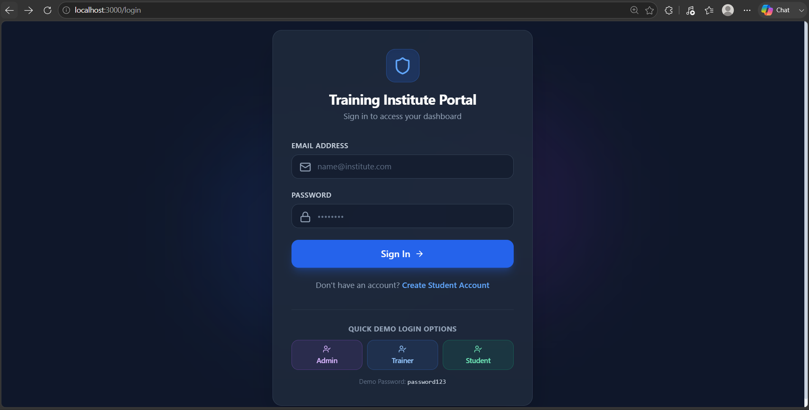

### Registration Page

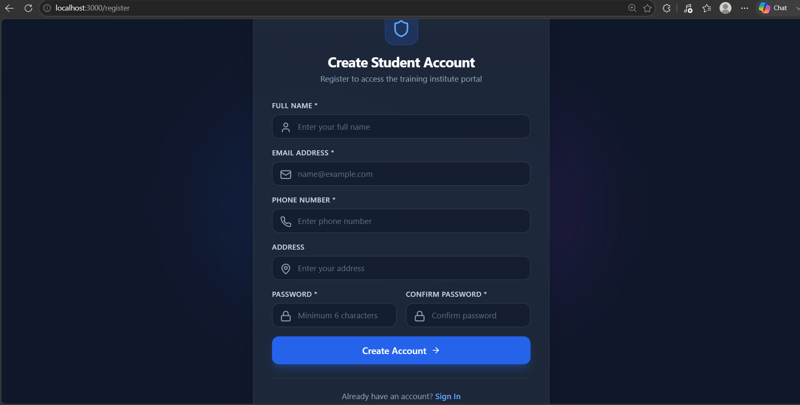

### Admin Dashboard

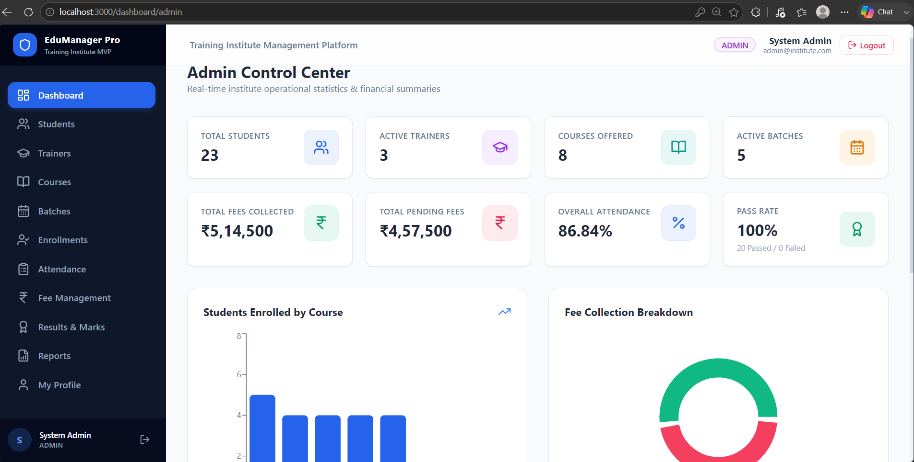

### Student Management

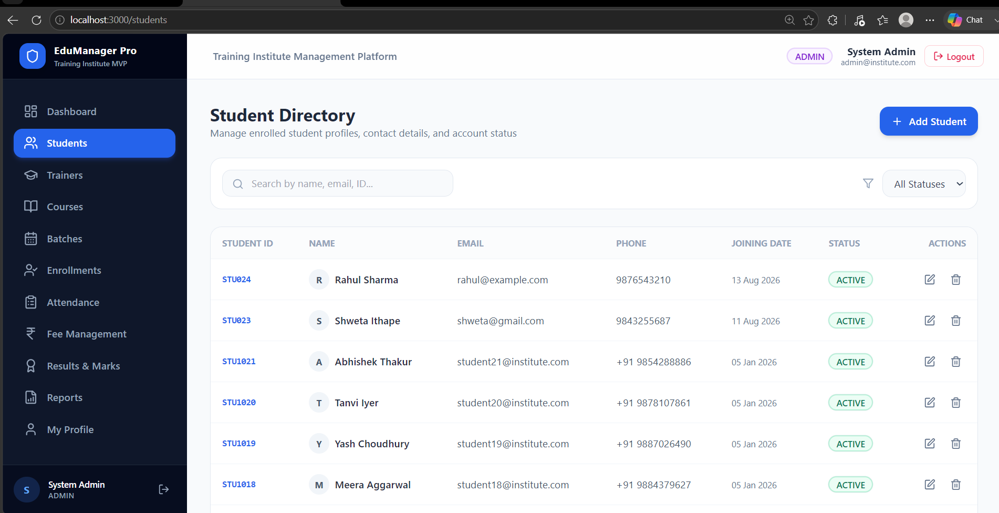

### Trainer Management

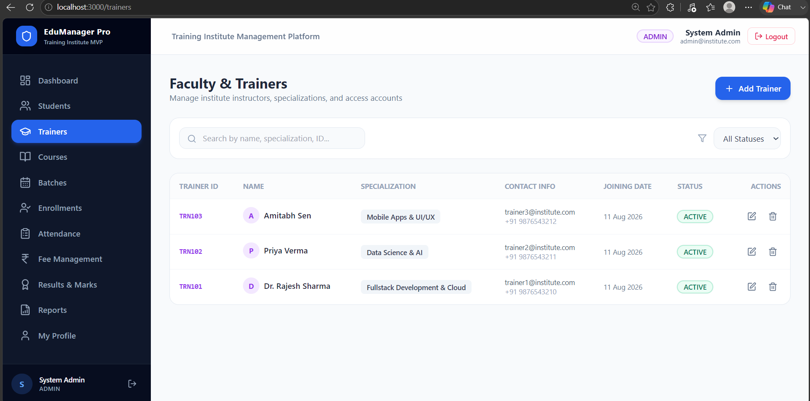

### Course Management

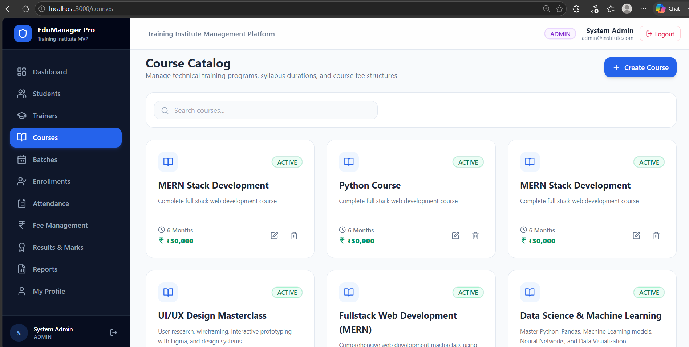

### Batch Management

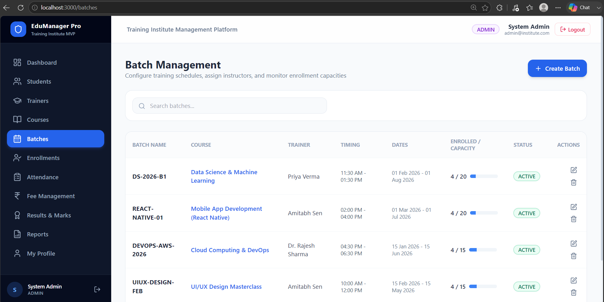

### Enrollment Management

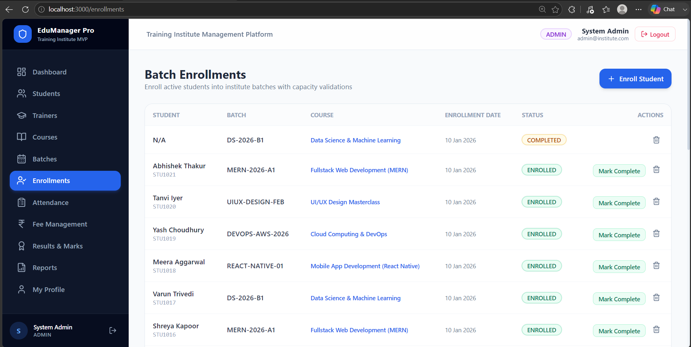

### Attendance Management


### Fees Management

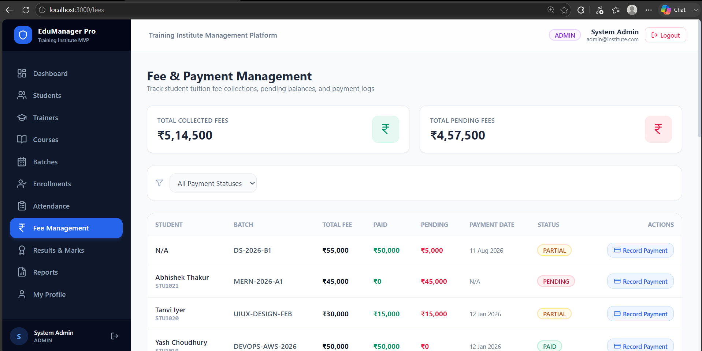

### Results Management

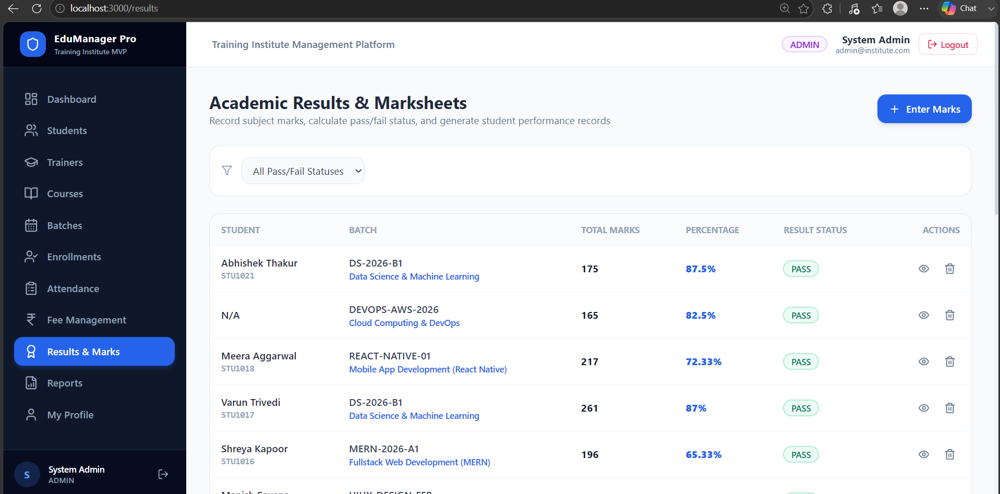

### Reports

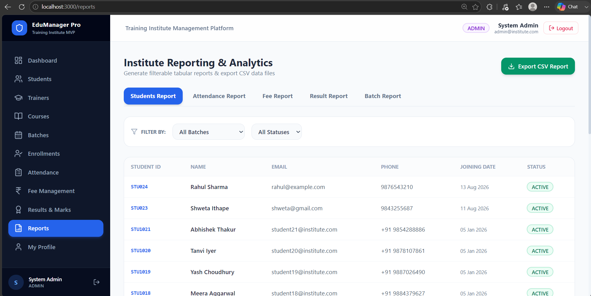

### Trainer Dashboard

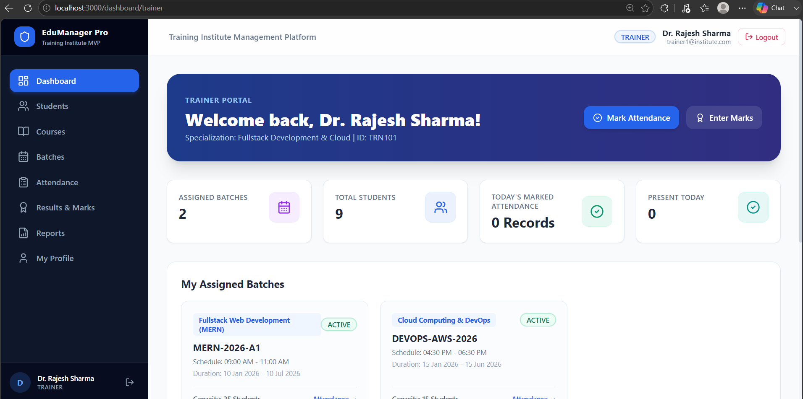

### Student Dashboard

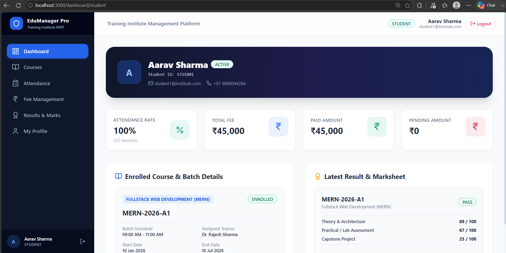

## 18. Deployment

For deployment, configure:

-   MongoDB Atlas for production database
-   Backend hosting such as Render or another Node-compatible service
-   Frontend hosting such as Vercel/Netlify or another React-compatible
    service

Update frontend API configuration to point to the deployed backend.

## 19. Known Limitations

-   The project is an assessment/MVP implementation and may require
    additional hardening before large-scale production use.
-   Email verification and password-reset email workflows are not part
    of the core MVP unless separately implemented.
-   Production monitoring, centralized logging, backups, and advanced
    audit trails may require additional infrastructure.
-   UI and business workflows can be extended with additional
    institute-specific rules.

## 20. Future Enhancements

-   Email/SMS notifications
-   Online fee payment gateway
-   Automated certificates
-   Advanced analytics
-   Bulk import/export
-   Fine-grained permissions
-   Audit logs
-   Password reset by email
-   Cloud file storage
-   Automated deployment pipeline
-   Automated unit/integration test suite
-   Multi-branch institute support

## 21. Security Notes

-   Passwords are hashed before storage.
-   JWT is used for protected API access.
-   Role middleware restricts privileged operations.
-   Environment secrets must remain outside source control.
-   Production deployments should use HTTPS and a strong JWT secret.

## 22. Author

**Shweta Ithape**

Developed as an internship technical assessment project using the MERN
stack.
